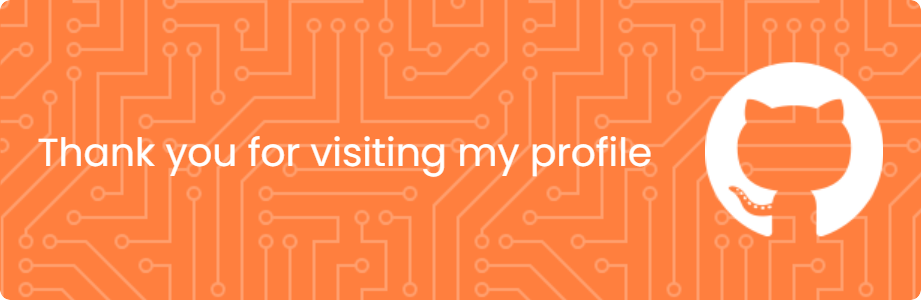

  

###

  
  

###

  

###

<h4 align="center">Welcome to My GitHub profile!</h4>

###

<h6 align="center">I am a student with an interest in programming. This repository contains projects that I have worked on, both in the form of experiments, collaborations, and independent learning results.</h6>

###

<h6 align="center">-- Fhatoni Nur Wardana --</h6>

###

<h3 align="center">🛠 Language and tools</h3>

###

  
  
  
  
  
  
  
  
  
  
  

###

  
  
  
  
  
  
  
  
  
  
  
  
  
  
  
  
  
  
  
  
  

###

  
  
  
  
  

###

<h3 align="center">🔥   My Stats</h3>

###

 

###

###

